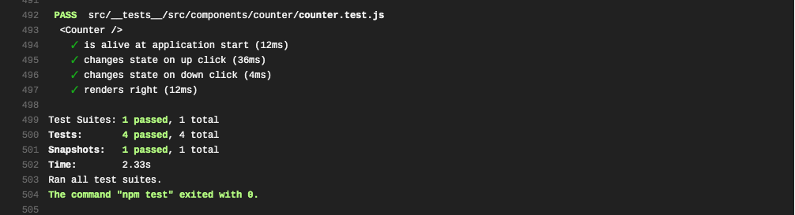
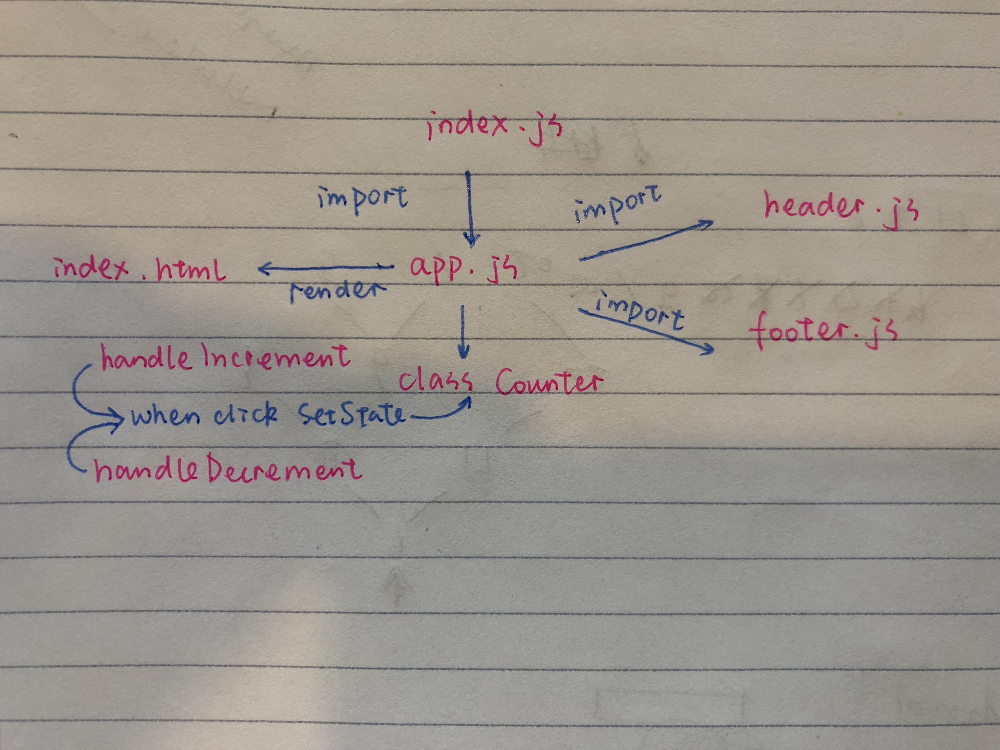

 LAB-27
=================================================

## React tdd

### Author: Vanessa

### Links and Resources
* [repo](https://github.com/401-advanced-javascript-v/lab-27)
* 
  
* [AWS-manual](http://lab27tdd.s3-website-us-west-2.amazonaws.com/)
* [AWS-cloudFormation](https://lab27tddstack-lab27tddbucket-11my77v456tot.s3.us-east-2.amazonaws.com/index.html)
* [netlify](https://jovial-mestorf-ea20c9.netlify.com/)

#### Documentation
* styleguidist 
    run `npx styleguidist server`
    then go to http://localhost:6060/#

### Setup
#### `.env` requirements
* `npm i` install dependencies

#### Running the app
* `npm start`

### Components
* header
* footer
* counter

#### Tests
* How do you run tests?
  * `npm test`

#### UML
